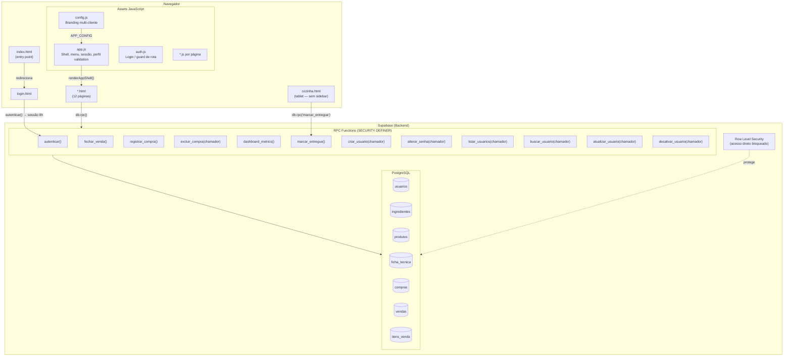
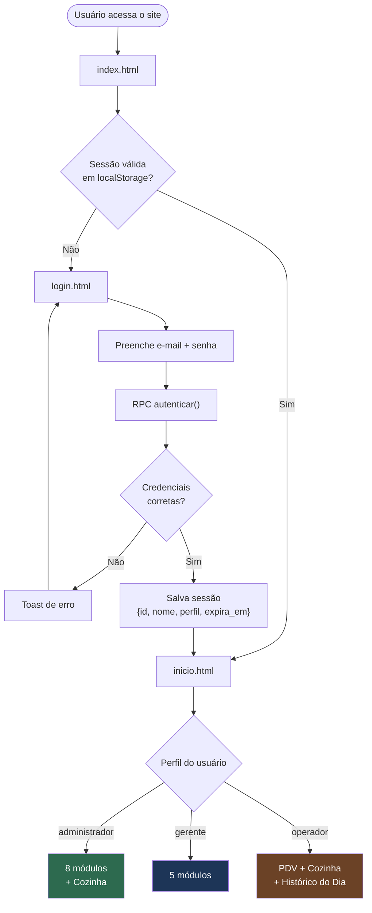
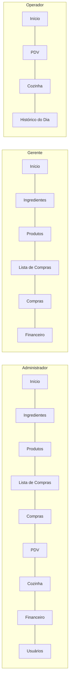
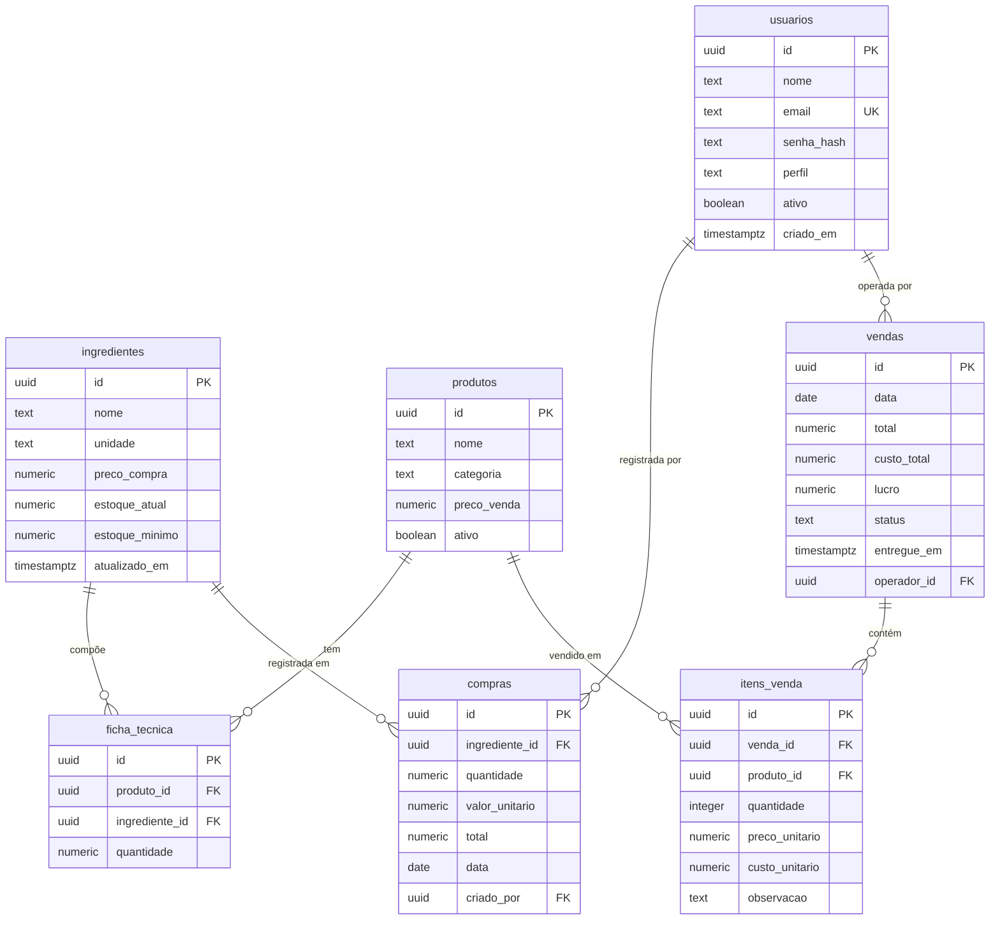
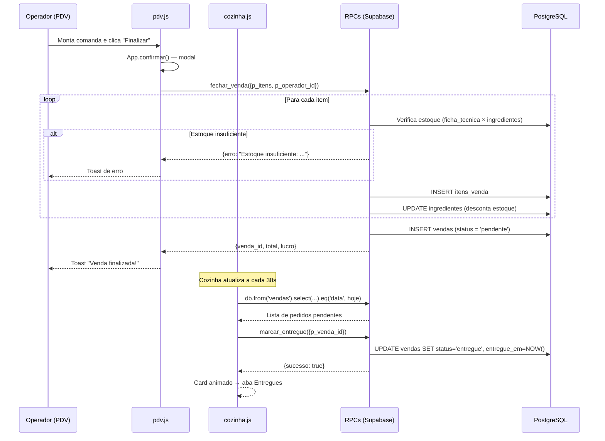
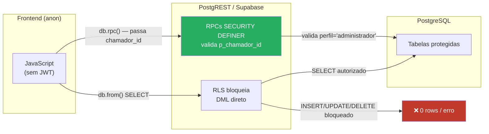

# Sistema de Gestão Comercial

Sistema web de gestão para pequenos negócios — controle de estoque, compras, vendas e indicadores financeiros. Desenvolvido para a **Pastelaria Bom Sabor** como projeto piloto, com arquitetura desenhada para ser adaptada a outros clientes via `config.js`.

> Projeto sem fins lucrativos desenvolvido gratuitamente para uma microempresa.

---

## Stack

| Camada | Tecnologia |
|--------|-----------|
| Frontend | HTML + CSS + Vanilla JS (sem frameworks) |
| Backend | Supabase (PostgreSQL + RPC functions) |
| Auth | RPC customizada `autenticar()` + `pgcrypto` |
| Hosting | GitHub Pages |
| Sessão | `localStorage` com TTL de 8h |

---

## Arquitetura do Sistema



---

## Fluxo de Autenticação e Navegação



---

## Perfis de Acesso



---

## Banco de Dados — Modelo Entidade-Relacionamento



---

## Fluxo de Venda — da Abertura à Entrega



---

## Arquitetura de Segurança



**Princípios aplicados:**
- Todo `INSERT`, `UPDATE` e `DELETE` sensível passa por RPC com `SECURITY DEFINER`
- RPCs que alteram dados exigem `p_chamador_id` (UUID do usuário logado) validado contra a tabela `usuarios`
- Nenhuma policy de `DELETE` direta existe em tabelas críticas (`compras`, `vendas`, `usuarios`)
- `isLoggedIn()` rejeita sessões com `perfil` fora do conjunto `{administrador, gerente, operador}`
- Todos os valores do banco inseridos via `innerHTML` passam por `App.escapeHtml()` (XSS prevention)

---

## Módulos — O que cada página faz

| Página | Perfis | Função |
|--------|--------|--------|
| **Início** | Todos | Hub de navegação adaptado por perfil; alertas de estoque para gerente e admin |
| **Ingredientes** | Admin, Gerente | CRUD completo com controle de estoque, preço de compra e status |
| **Produtos** | Admin, Gerente | Cadastro com ficha técnica, custo calculado, margem de lucro e filtros avançados |
| **Lista de Compras** | Admin, Gerente | Ingredientes com estoque crítico ou em atenção que precisam reposição |
| **Compras** | Admin, Gerente | Registro de entradas no estoque — atualiza `estoque_atual` via RPC atômica |
| **PDV (Vendas)** | Admin, Operador | Totem de vendas: categorias → cards de produto → carrinho → finalizar |
| **Cozinha** | Admin, Operador | Acompanhamento de pedidos em tempo real: fila pendente + entregues; botão "Entregar" |
| **Financeiro** | Admin, Gerente | Indicadores do mês + histórico mensal + últimas vendas |
| **Histórico do Dia** | Admin, Operador | Vendas realizadas hoje com total e lucro |
| **Usuários** | Admin | Gerenciamento de usuários e perfis via RPCs autorizadas |

---

## RPC Functions (Supabase)

| Função | Auth exigida | Descrição |
|--------|-------------|-----------|
| `autenticar(email, senha)` | — | Login via `pgcrypto` — retorna dados do usuário ou erro |
| `fechar_venda(itens, operador_id)` | — | Fecha venda atomicamente: valida estoque, insere venda + itens, desconta ingredientes |
| `registrar_compra(...)` | — | Registra compra e incrementa `estoque_atual` do ingrediente |
| `excluir_compra(id, chamador_id)` | admin | Exclui compra e reverte estoque — operação atômica |
| `marcar_entregue(venda_id)` | — | Atualiza `status='entregue'` e `entregue_em=NOW()` |
| `dashboard_metrics()` | — | Retorna lucro, receita, gastos do mês e estoque crítico |
| `criar_usuario(nome, email, senha, perfil, chamador_id)` | admin | Cria usuário com senha hasheada via `bcrypt` |
| `alterar_senha(usuario_id, nova_senha, chamador_id)` | admin ou próprio | Atualiza senha com novo hash |
| `listar_usuarios(chamador_id)` | admin | SELECT seguro — sem policy direta na tabela |
| `buscar_usuario(id, chamador_id)` | admin | SELECT por ID via RPC |
| `atualizar_usuario(id, nome, email, perfil, chamador_id)` | admin | UPDATE com validação de perfil |
| `desativar_usuario(id, chamador_id)` | admin | Soft delete — impede auto-desativação |

---

## Estrutura de Arquivos

```
gestao_comercial/
├── index.html                  # Entry point — redireciona para inicio ou login
├── login.html
├── inicio.html                 # Hub pós-login (layout por perfil)
├── ingredientes.html
├── produtos.html
├── lista-compras.html
├── compras.html
├── pdv.html                    # Totem de vendas (3 colunas)
├── cozinha.html                # Layout tablet — sem sidebar
├── historico-dia.html
├── financeiro.html             # Indicadores + histórico mensal
├── usuarios.html
├── estoque.html
├── assets/
│   ├── css/
│   │   └── style.css           # Único arquivo de estilos
│   └── js/
│       ├── config.js           # Branding do cliente (única fonte de verdade)
│       ├── app.js              # Shell, menu, sessão, perfil validation
│       ├── auth.js             # Login e guard de rotas
│       ├── supabase-client.js  # Inicialização do Supabase
│       ├── api.js              # Funções de acesso ao banco reutilizáveis
│       ├── inicio.js
│       ├── ingredientes.js
│       ├── produtos.js
│       ├── lista-compras.js
│       ├── compras.js
│       ├── pdv.js
│       ├── cozinha.js          # Polling 30s, tabs Fila/Entregues, RPC marcar_entregue
│       ├── historico-dia.js
│       ├── financeiro.js
│       └── usuarios.js         # Toda gestão via RPCs autorizadas
└── supabase/
    ├── migrations/
    │   ├── 001_schema_supabase.sql         # Schema inicial + RPCs base
    │   ├── 002_add_categoria_produtos.sql  # Coluna categoria em produtos
    │   ├── 003_security_hardening.sql      # RLS + remoção de policies permissivas
    │   ├── 004_perfil_gerente.sql          # Perfil gerente
    │   ├── 005_observacao_itens_venda.sql  # Campo observação por item
    │   ├── 006_status_vendas.sql           # Coluna status + entregue_em em vendas
    │   ├── 007_rpc_marcar_entregue.sql     # RPC para atualização de status da cozinha
    │   └── 008_security_fixes.sql          # Auditoria: chamador_id, XSS, policies
    ├── seed.sql                            # Usuários padrão (3 perfis)
    └── seed_cardapio.sql                   # Produtos e ingredientes de exemplo
```

---

## Configuração para Novo Cliente

Edite apenas `assets/js/config.js`:

```javascript
const APP_CONFIG = {
  nome: 'Nome do Negócio',       // exibido na sidebar e login
  slogan: 'Subtítulo opcional',
  logo: null,                    // ou 'assets/img/logo.png'
  logoAlturaSidebar: 48,
  logoAlturaLogin: 72,
  descricaoLogin: 'Descrição curta do sistema.',
  featuresLogin: [
    'Funcionalidade 1',
    'Funcionalidade 2',
  ],
};
```

Nenhum outro arquivo precisa ser alterado para rebrand.

---

## Setup — Banco de Dados (Supabase)

1. Crie um projeto no [Supabase](https://supabase.com)
2. Execute as migrations em ordem no **SQL Editor**:
   ```
   001_schema_supabase.sql
   002_add_categoria_produtos.sql
   003_security_hardening.sql
   004_perfil_gerente.sql
   005_observacao_itens_venda.sql
   006_status_vendas.sql
   007_rpc_marcar_entregue.sql
   008_security_fixes.sql
   ```
3. Execute `seed.sql` para criar os usuários padrão
4. _(Opcional)_ Execute `seed_cardapio.sql` para dados de exemplo
5. Atualize `assets/js/supabase-client.js` com a URL e chave anon do seu projeto

---

## Decisões de Arquitetura

- **Sem React/Vue** — Vanilla JS intencional; o time domina a stack sem overhead de framework
- **Sem Supabase Auth nativo** — autenticação customizada via `pgcrypto` para controle total dos perfis
- **Sem Node.js** — Supabase substitui completamente qualquer backend intermediário
- **RPC SECURITY DEFINER** — operações críticas (venda, compra, cozinha) rodam com permissões elevadas no servidor
- **`p_chamador_id` em RPCs sensíveis** — autorização server-side; o frontend não pode falsificar o chamador sem ter o UUID real da sessão
- **Soft delete em produtos** — `ativo = false` preserva histórico financeiro
- **`config.js` como única fonte de verdade** — sistema desenhado para multi-cliente sem reescrita de código
- **Polling na Cozinha** — atualização automática a cada 30s; sem WebSocket para manter a stack simples
