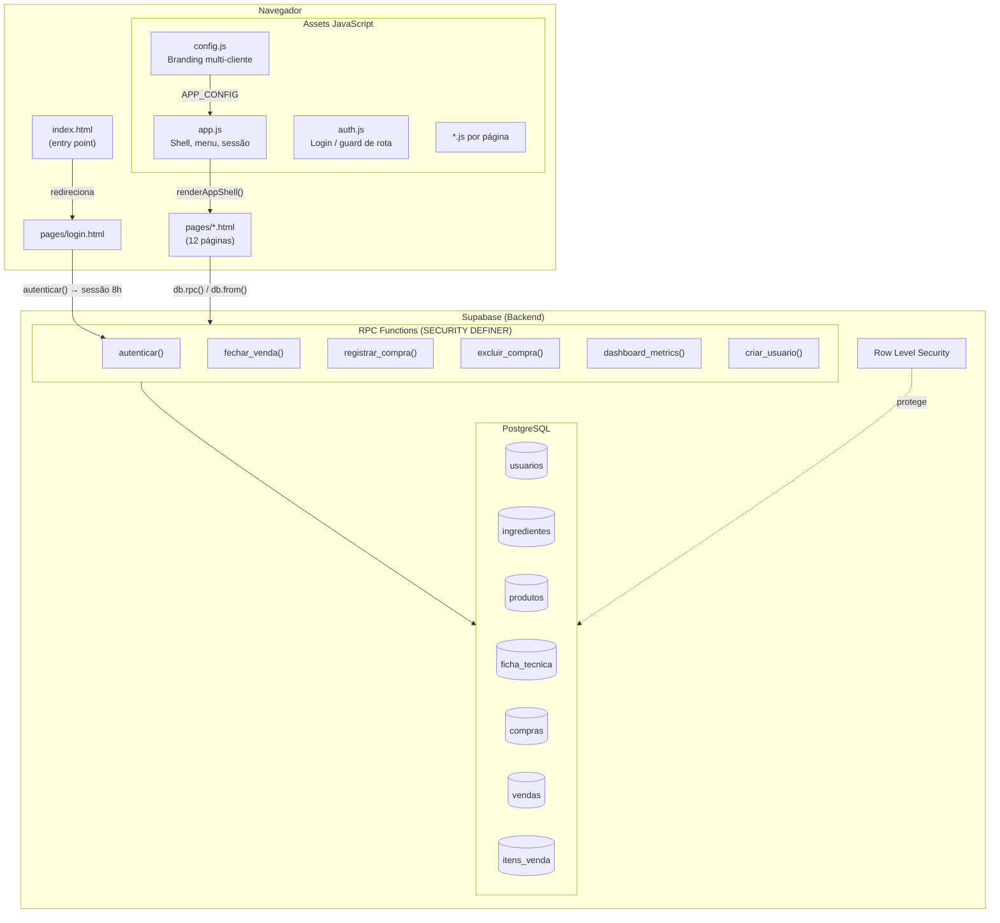
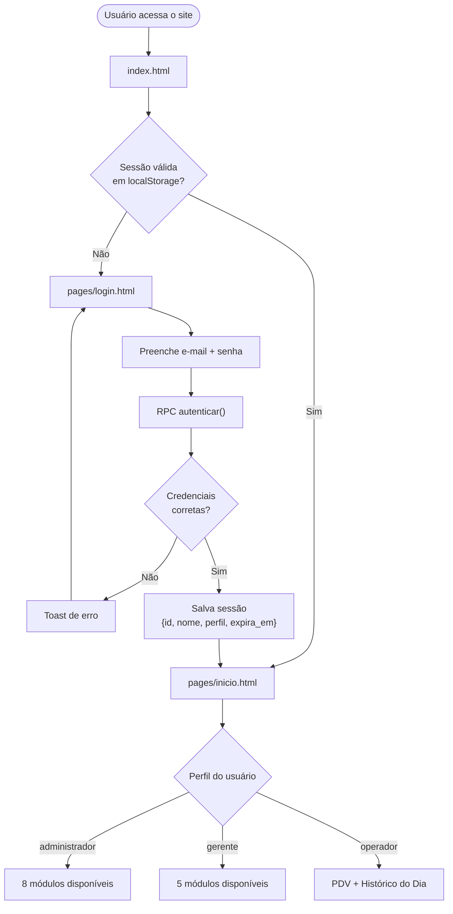
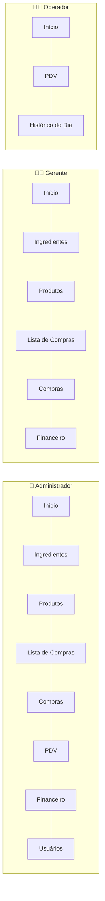
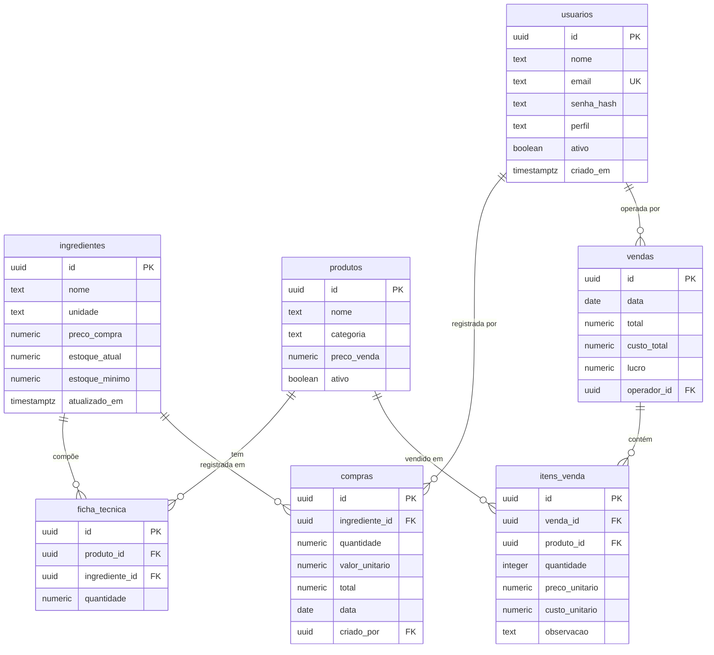
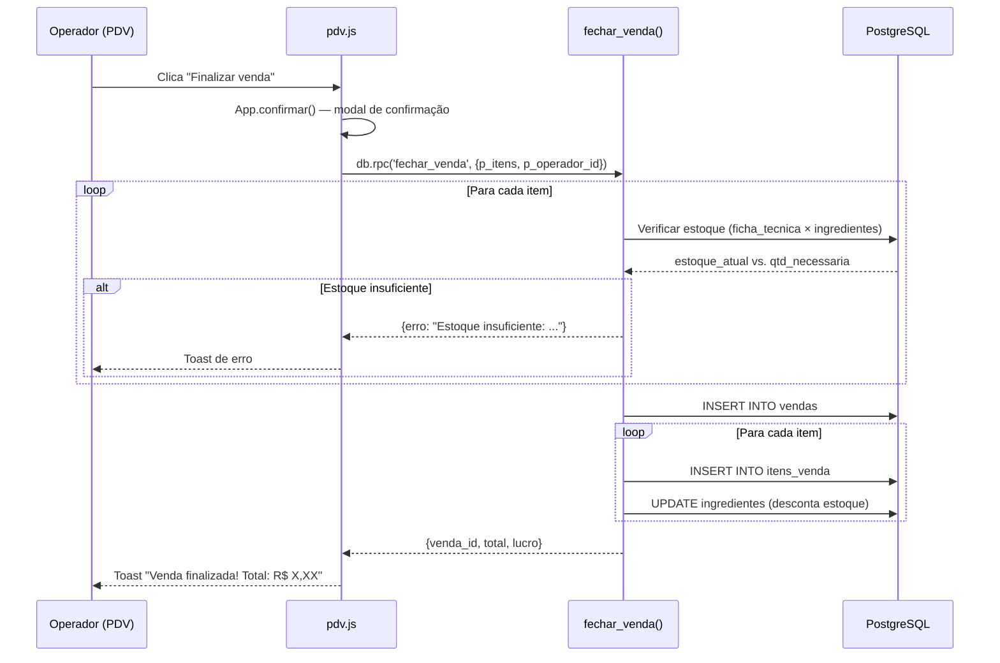

# Sistema de Gestão Comercial

Sistema web de gestão para pequenos negócios — controle de estoque, compras, vendas e indicadores financeiros. Desenvolvido para a **Pastelaria Bom Sabor** como projeto piloto, com arquitetura desenhada para ser adaptada a outros clientes via `config.js`.

> Projeto sem fins lucrativos desenvolvido gratuitamente para uma microempresa.

---

## Stack

| Camada | Tecnologia |
|--------|-----------|
| Frontend | HTML + CSS + Vanilla JS (sem frameworks) |
| Backend | Supabase (PostgreSQL + RPC functions) |
| Auth | RPC customizada `autenticar()` + `pgcrypto` |
| Hosting | GitHub Pages |
| Sessão | `localStorage` com TTL de 8h |

---

## Arquitetura do Sistema



---

## Fluxo de Autenticação e Navegação



---

## Perfis de Acesso



---

## Banco de Dados — Modelo Entidade-Relacionamento



---

## Fluxo de Venda — RPC `fechar_venda()`



---

## Estrutura de Arquivos

```
gestao_comercial/
├── index.html                  # Entry point — redireciona para pages/
├── pages/                      # Todas as páginas da aplicação
│   ├── login.html
│   ├── inicio.html             # Hub pós-login (layout por perfil)
│   ├── ingredientes.html
│   ├── produtos.html
│   ├── lista-compras.html
│   ├── compras.html
│   ├── pdv.html                # Totem de vendas (3 colunas)
│   ├── historico-dia.html
│   ├── financeiro.html         # Indicadores + histórico mensal
│   └── usuarios.html
├── assets/
│   ├── css/
│   │   └── style.css           # Único arquivo de estilos
│   └── js/
│       ├── config.js           # Branding do cliente (única fonte de verdade)
│       ├── app.js              # Shell, menu, sessão, utilitários
│       ├── auth.js             # Login e guard de rotas
│       ├── supabase-client.js  # Inicialização do Supabase
│       ├── inicio.js
│       ├── ingredientes.js
│       ├── produtos.js
│       ├── lista-compras.js
│       ├── compras.js
│       ├── pdv.js
│       ├── historico-dia.js
│       ├── financeiro.js
│       └── usuarios.js
└── supabase/
    ├── migrations/
    │   ├── 001_schema_supabase.sql     # Schema inicial + RPCs
    │   ├── 002_add_categoria_produtos.sql
    │   ├── 003_security_hardening.sql
    │   ├── 004_perfil_gerente.sql
    │   └── 005_observacao_itens_venda.sql
    ├── seed.sql                # Usuários padrão
    └── seed_cardapio.sql       # Produtos e ingredientes de exemplo
```

---

## Módulos — O que cada página faz

| Página | Perfis | Função |
|--------|--------|--------|
| **Início** | Todos | Hub de navegação adaptado por perfil; gerente vê alertas de estoque em tempo real |
| **Ingredientes** | Admin, Gerente | CRUD completo de ingredientes com controle de estoque e preço de compra |
| **Produtos** | Admin, Gerente | Cadastro de produtos com ficha técnica de ingredientes e preço de venda |
| **Lista de Compras** | Admin, Gerente | Ingredientes com estoque crítico ou em atenção que precisam reposição |
| **Compras** | Admin, Gerente | Registro de entradas no estoque — atualiza `estoque_atual` automaticamente |
| **PDV** | Admin, Operador | Totem de vendas: categorias → cards de produto → carrinho → finalizar |
| **Financeiro** | Admin, Gerente | Indicadores do mês + histórico mensal + últimas 5 vendas + gráfico |
| **Histórico do Dia** | Admin, Operador | Vendas realizadas hoje com total e lucro do dia |
| **Usuários** | Admin | Gerenciamento de usuários e perfis de acesso |

---

## RPC Functions (Supabase)

| Função | Descrição |
|--------|-----------|
| `autenticar(email, senha)` | Login customizado via `pgcrypto` — retorna dados do usuário ou erro |
| `fechar_venda(itens, operador_id)` | Fecha venda atomicamente: valida estoque, insere venda + itens, desconta ingredientes |
| `registrar_compra(...)` | Registra compra e incrementa `estoque_atual` do ingrediente |
| `excluir_compra(id)` | Exclui compra e reverte o estoque — operação atômica |
| `dashboard_metrics()` | Retorna lucro, receita e gastos do mês + contagem de estoque crítico |
| `criar_usuario(...)` | Cria usuário com senha hasheada via `bcrypt` |
| `alterar_senha(id, nova_senha)` | Atualiza senha com novo hash |

---

## Configuração para Novo Cliente

Edite apenas `assets/js/config.js`:

```javascript
const APP_CONFIG = {
  nome: 'Nome do Negócio',       // exibido na sidebar e login
  slogan: 'Subtítulo opcional',
  logo: null,                    // ou 'assets/img/logo.png'
  logoAlturaSidebar: 48,
  logoAlturaLogin: 72,
  descricaoLogin: 'Descrição curta do sistema.',
  featuresLogin: [
    'Funcionalidade 1',
    'Funcionalidade 2',
  ],
};
```

Nenhum outro arquivo precisa ser alterado para rebrand.

---

## Setup — Banco de Dados (Supabase)

1. Crie um projeto no [Supabase](https://supabase.com)
2. Execute as migrations em ordem no **SQL Editor**:
   ```
   001_schema_supabase.sql
   002_add_categoria_produtos.sql
   003_security_hardening.sql
   004_perfil_gerente.sql
   005_observacao_itens_venda.sql
   ```
3. Execute `seed.sql` para criar os usuários padrão
4. _(Opcional)_ Execute `seed_cardapio.sql` para dados de exemplo
5. Atualize `assets/js/supabase-client.js` com a URL e chave anon do seu projeto

---

## Decisões de Arquitetura

- **Sem React/Vue** — Vanilla JS intencional; ambos os devs dominam a stack
- **Sem Supabase Auth nativo** — autenticação customizada via `pgcrypto` para controle total
- **Sem Node.js** — Supabase substitui completamente qualquer backend
- **RPC SECURITY DEFINER** — operações críticas (venda, compra) rodam com permissões elevadas no servidor, não expostas ao cliente
- **Soft delete em produtos** — `ativo = false` preserva histórico financeiro
- **`config.js` como única fonte de verdade** — sistema desenhado para multi-cliente
